# Tagly — Technical documentation

**Audience:** engineers, operators, and reviewers. **As-built** from the repository; for installation steps see the [README](../README.md). For product-level ADR narrative, see [requirements/architecture.md](../requirements/architecture.md).

---

## 1. System context

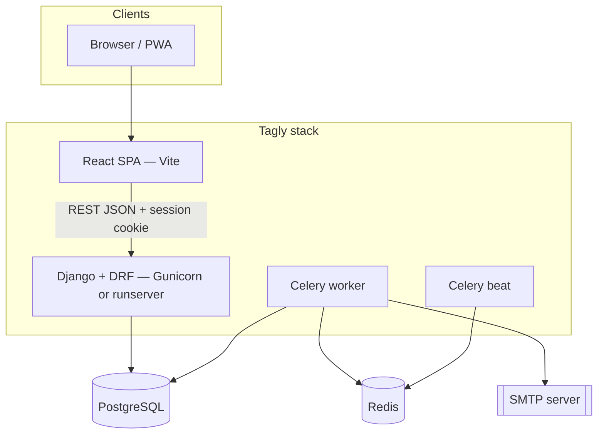

---

## 2. Container / runtime (development Compose)

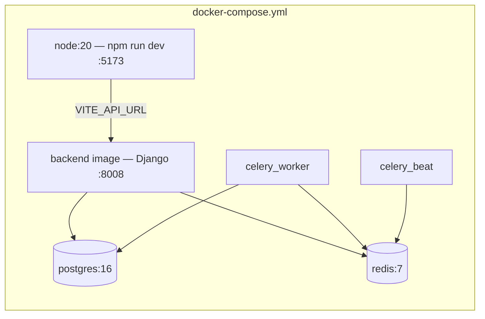

| Service | Role |
|---------|------|
| `frontend` | Vite dev server; `VITE_API_URL` points at the API base (must be reachable from the browser). |
| `backend` | Django ASGI/WSGI app; REST API under `/api/v1/`. |
| `celery_worker` | Async tasks (e.g. notifications). |
| `celery_beat` | Periodic schedule (`notifications.tasks.check_overdue_borrows` hourly). |
| `db` | PostgreSQL 16. |
| `redis` | Celery broker and result backend. |

---

## 3. Backend application map

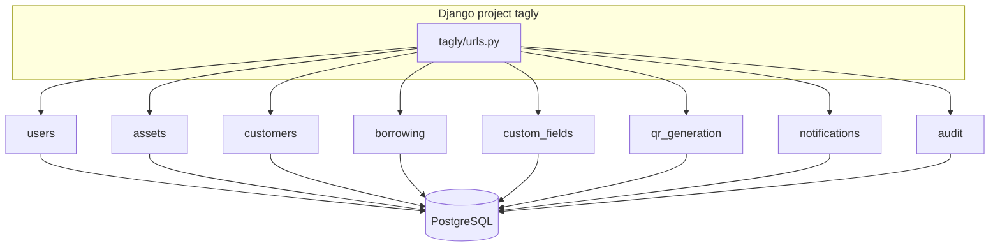

### API mount points

| Prefix | App |
|--------|-----|
| `/api/v1/health/` | Health check |
| `/api/v1/users/` | Auth, CSRF, profile, preferences, user admin |
| `/api/v1/assets/` | Assets CRUD, GUID lookup, export, delete |
| `/api/v1/customers/` | Customers, countries |
| `/api/v1/borrowing/` | List, create, detail, return, asset history |
| `/api/v1/custom-fields/` | Definitions + values by entity |
| `/api/v1/qr/` | Sticker templates, PDF generation |
| `/api/v1/notifications/` | Notification log (admin) |
| `/api/v1/audit/` | Audit log (admin) |

---

## 4. Domain model (ORM class diagram)

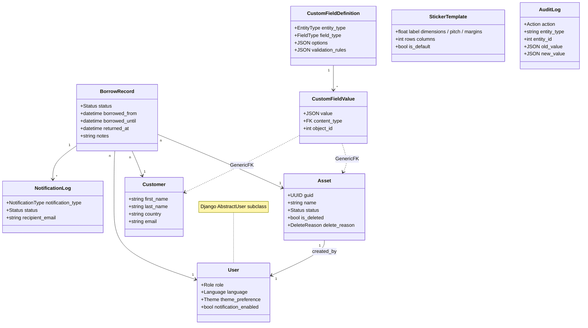

**Enums (representative):**

- `Asset.Status`: `AVAILABLE`, `BORROWED`, `DELETED`
- `BorrowRecord.Status`: `ACTIVE`, `RETURNED`
- `User.Role`: `USER`, `ADMIN`
- `CustomFieldDefinition.FieldType`: `DATE`, `STRING`, `NUMBER`, `DECIMAL`, `SINGLE_SELECT`, `MULTI_SELECT`

**Soft delete:** Assets use `is_deleted` and optional `delete_reason` rather than hard removal in normal operation.

---

## 5. Process diagrams

### 5.1 Borrow and return (happy path)

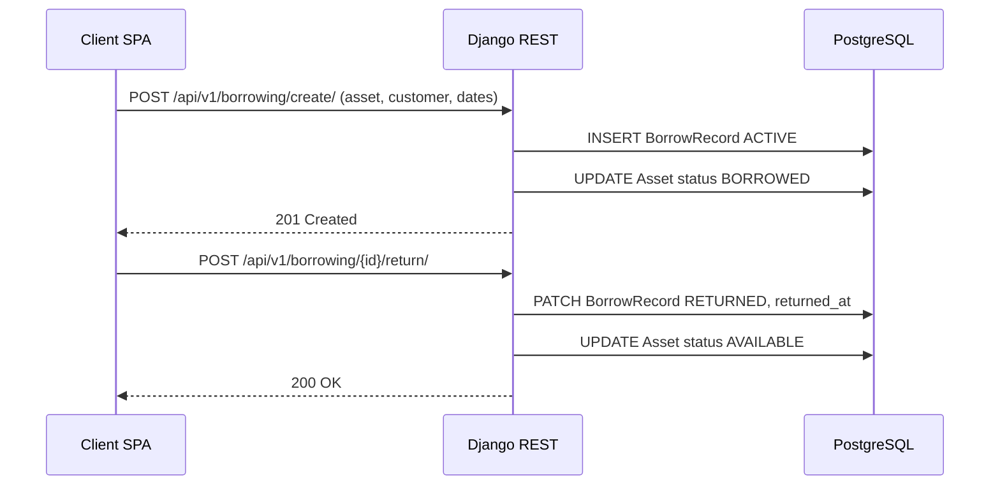

### 5.2 Asset identification by QR (conceptual)

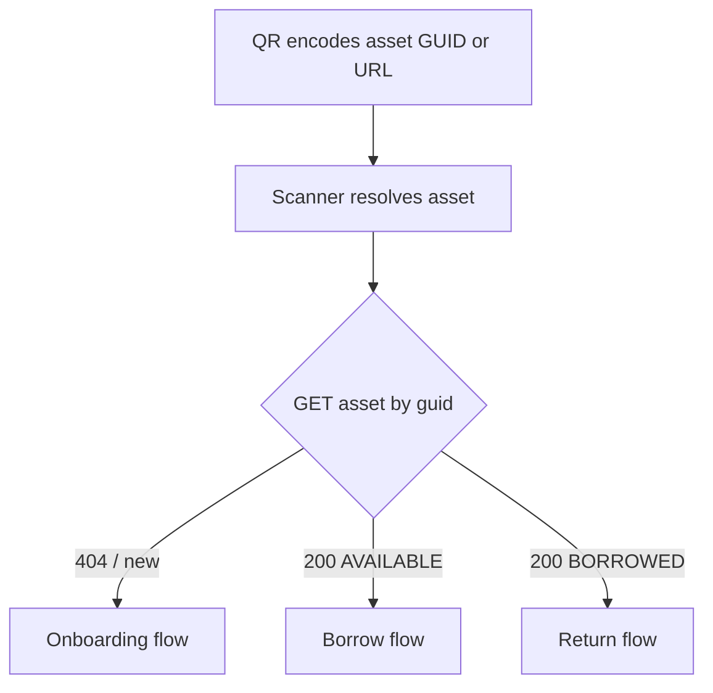

### 5.3 Overdue notifications (scheduled)

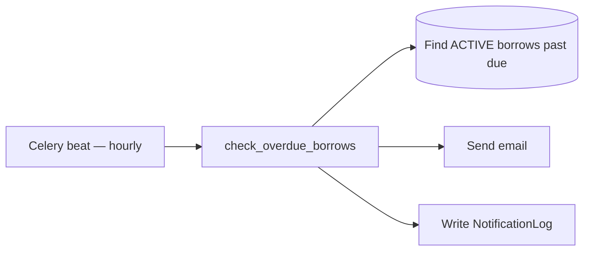

Schedule is defined in `backend/tagly/celery.py` (`crontab(minute=0)`).

### 5.4 Request path — session auth

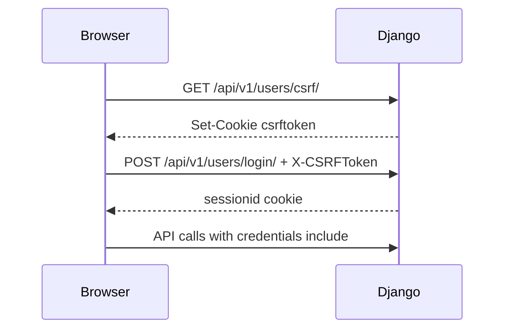

---

## 6. Frontend structure

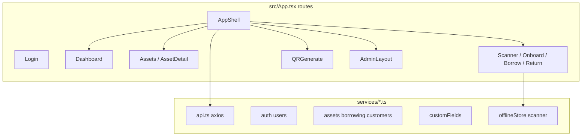

**Stack:** React 19, TypeScript, Vite 8, MUI 7, React Router 7, i18next, Axios, `idb` for offline queue, `html5-qrcode` for scanning.

---

## 7. CI/CD

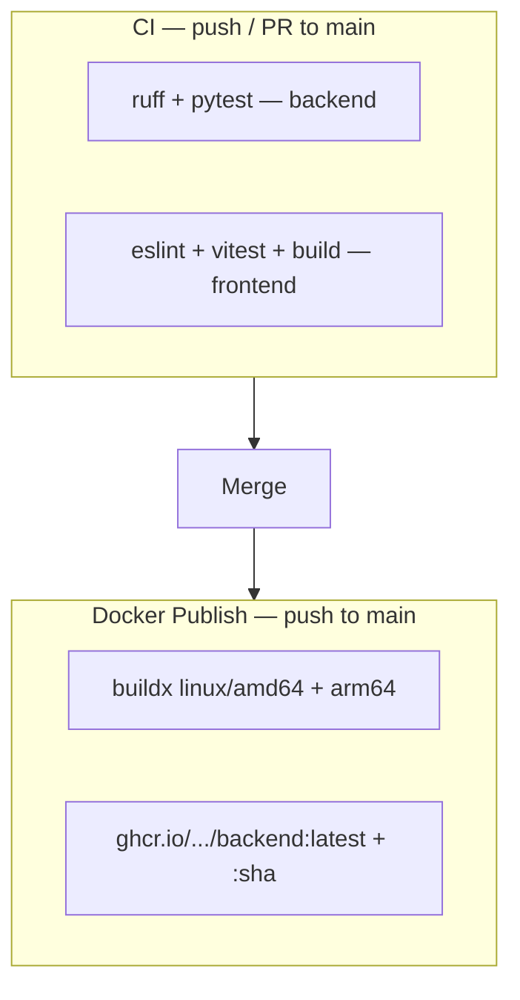

- **CI:** `.github/workflows/ci.yml` — Postgres + Redis services for Django tests.
- **Images:** `.github/workflows/docker-publish.yml` — backend image only to GHCR; frontend is typically built/served per environment (Compose uses Node container for dev).

---

## 8. Security summary

| Topic | Implementation |
|-------|----------------|
| Authentication | Django sessions; login/logout API |
| CSRF | Cookie + `X-CSRFToken` on mutating requests |
| Authorization | DRF permissions; `ADMIN` for sensitive endpoints |
| CORS / CSRF origins | `CORS_ALLOWED_ORIGINS`, `CSRF_TRUSTED_ORIGINS` env |
| HTTPS behind proxy | `DJANGO_BEHIND_HTTPS_PROXY` for secure cookies / scheme |
| Secrets | Environment variables only (see `.env.example`) |
| Audit | `AuditLog` on mutations |
| OpenAPI UI | `/api/docs/` and `/api/schema/` require **IsAuthenticated** (session); avoids anonymous enumeration of the surface in production |

---

## 9. OpenAPI schema

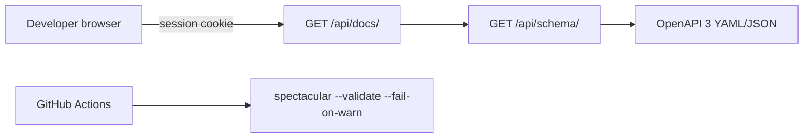

- **Generator:** `drf_spectacular` (`DEFAULT_SCHEMA_CLASS` in DRF settings).
- **Tags:** Grouped by area (users, assets, customers, borrowing, custom-fields, qr, notifications, audit, health).
- **Binary responses:** Asset Excel export and QR PDF generation are documented as binary media types in the schema.

---

## 10. Operational notes

- **Scaling / data volume:** Designed for large asset counts with indexes, pagination, and streaming-style Excel export (see README scaling notes).
- **Production Compose:** Prefer a production WSGI server (e.g. Gunicorn) and a static build of the frontend behind nginx or a CDN—not the dev Vite server.
- **Raspberry Pi / ARM:** Images are multi-arch for `linux/arm64`.

---

## 11. Related files (source of truth)

| Concern | Location |
|---------|----------|
| URL routing | `backend/tagly/urls.py`, `backend/*/urls.py` |
| OpenAPI / Spectacular | `drf_spectacular` in `INSTALLED_APPS`, `SPECTACULAR_SETTINGS` in `backend/tagly/settings.py`, schema routes in `tagly/urls.py` |
| Models | `backend/*/models.py` |
| Celery | `backend/tagly/celery.py`, `backend/*/tasks.py` |
| Frontend routes | `frontend/src/App.tsx` |
| API client config | `frontend/src/services/api.ts` |
| Compose topology | `docker-compose.yml` |
| Env template | `.env.example` |
