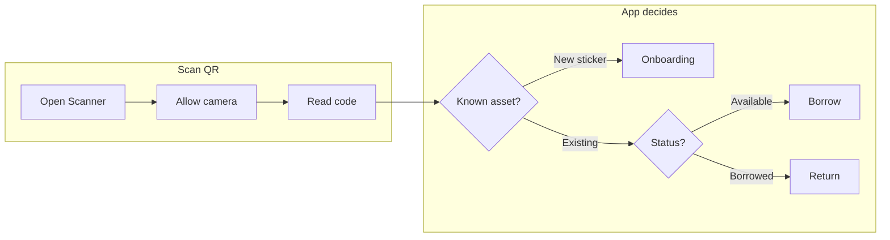
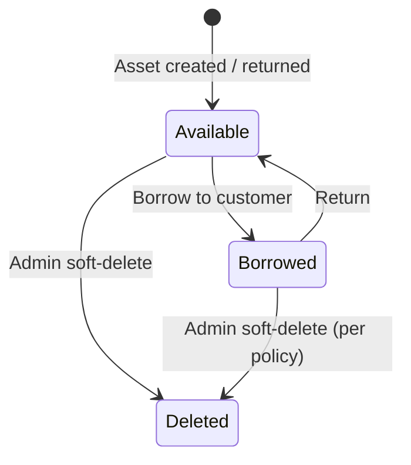

# Tagly — User guide

This guide is for **people who use Tagly** to track assets, scan QR codes, and manage lending. It does not cover developer setup (see the [README](../README.md)) or system architecture (see [technical.md](technical.md)).

---

## What Tagly does

Tagly helps organizations **track physical assets** (tools, equipment, kits) and **lend them to customers**. Each asset can have a **QR sticker**; scanning opens workflows on a phone or tablet. A **backoffice** view on desktop supports search, history, exports, and administration.

---

## Roles

| Role | What you can do |
|------|-----------------|
| **User** | Log in, use the dashboard, search and filter assets, export to Excel, use the scanner (onboard, borrow, return), generate QR sticker PDFs from templates |
| **Admin** | Everything a User can do, plus: configure **custom fields** for assets and customers, manage **sticker templates**, manage **users**, **delete** assets, view **audit** and **notification** logs |

Your administrator creates accounts and assigns the Admin role where needed.

---

## Signing in

1. Open the Tagly URL your organization provides (for local development this is often `http://localhost:5173`).
2. Enter your username and password.
3. If the organization uses HTTPS (e.g. behind a reverse proxy), use only the URL they gave you so the app can reach the API correctly.

---

## Backoffice (desktop-friendly)

### Dashboard

The dashboard summarizes activity and gives quick access to common tasks (exact widgets depend on your deployment).

### Assets

- **List** — Browse assets, filter by status (e.g. available vs borrowed), search by name.
- **Detail** — View one asset, its history, and custom fields.
- **Export** — Download filtered data as an Excel file (respects your permissions).

### QR sticker generation

1. Open **QR generate** (or the equivalent menu entry).
2. Choose a **template** (admins define label layouts).
3. Generate a **PDF** of stickers to print.

Templates describe rows, columns, and label dimensions on a sheet—not the graphic design of the QR itself, which is generated for each asset identifier.

---

## Scanner (mobile / PWA)

The scanner is optimized for **phones and tablets**. You can often **install** the site as an app (browser “Add to Home Screen”) for quicker access.

### Typical flow

1. **Open Scanner** from the menu.
2. Grant **camera** permission when asked.
3. Point at the **QR code** on the asset.
4. The app opens the right screen:
   - **Onboarding** — Register a new asset for a sticker that is not yet in the system (you enter name and any required custom fields).
   - **Borrow** — Link the asset to a customer for a period.
   - **Return** — Mark the active loan as returned.

Exact labels follow your **language** setting (e.g. English / German) if your administrator enabled translations.

### Offline use

When the network is unavailable, the app can **queue** certain actions locally (using the browser’s storage). When you are back online, the queue **syncs** in order.

- If the server state changed while you were offline (for example, someone else returned the asset), you may see a **message** asking you to refresh or resolve the conflict—**server data wins** for conflicts.

---

## Custom fields

Administrators can add **extra fields** for assets and/or customers (dates, text, numbers, single/multi select lists, and validation rules).

- **Users** fill these fields where the app shows them (onboarding, customer forms, etc.).
- **Mandatory** fields must be completed before saving.

---

## Borrowing and returns (conceptual)

- **Borrow** creates a record: which asset, which customer, dates, and optional notes.
- **Return** closes the active borrow for that asset.
- **History** on an asset shows past borrows (who, when).

Your organization may use **email notifications** for overdue items; that is configured on the server (SMTP, schedules).

---

## Theme and language

Signed-in users can usually set:

- **Light / dark** theme (Material Design–based UI).
- **Language** (where enabled), e.g. English or German.

Preferences are stored with your account where the product supports it.

---

## Common issues (users)

| Symptom | What to try |
|---------|-------------|
| Cannot log in | Confirm URL, caps lock, and that your account exists; contact an admin. |
| Scanner camera blank | Check browser permission for camera; try another browser; ensure HTTPS if required by the device. |
| “Something went wrong” after scan | Network issue or asset state changed; go online, retry, or open the asset from the asset list. |
| Excel export empty or slow | Check filters; very large exports may take time; ask an admin if timeouts occur. |
| App works on HTTP at home but not on HTTPS | The deployment must use matching **API URL** and **CORS** settings—this is an administrator / hosting issue, not something to fix in the browser. |

---

## Privacy and audit

Administrators can view **audit logs** of changes (who changed what and when). Use Tagly in line with your organization’s policies for personal data (customer names, contact details, etc.).
