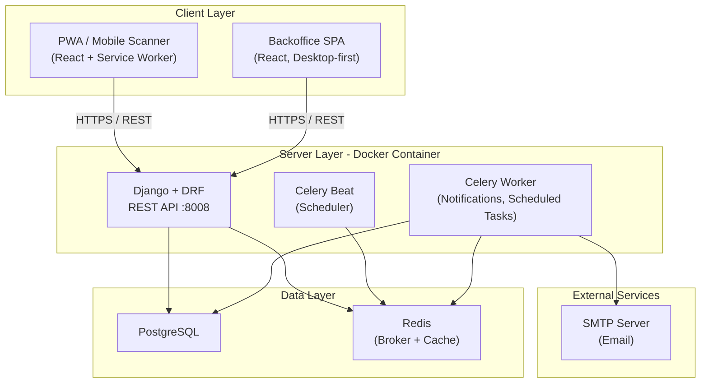
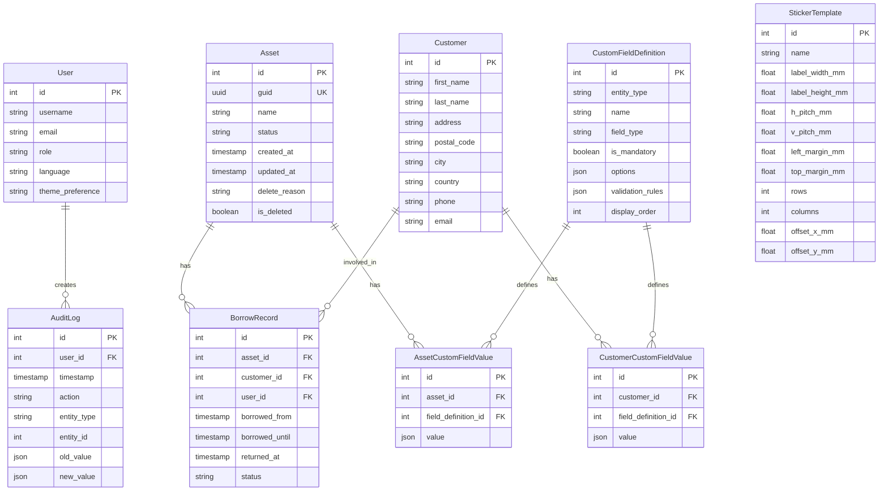
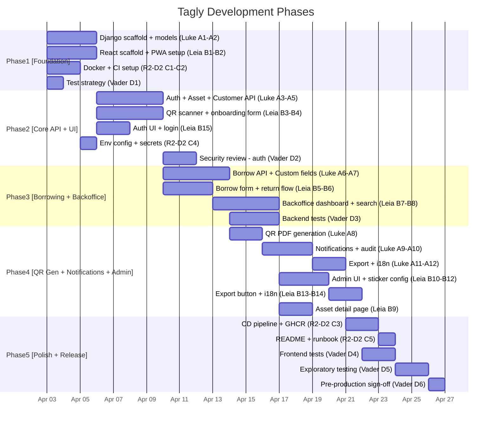

# Tagly — Master Plan and Architecture

**Orchestrated by**: Yoda | **Research by**: C-3PO
**Date**: 2026-04-02

---

## 1. Goal (one line)

Build **Tagly**, a multilingual, offline-capable PWA + backoffice web application for tracking lendable hardware/tools/assets via QR-code stickers, with borrowing workflows, overdue notifications, custom fields, and Excel export — deployed as a Dockerized Python backend on GHCR.

---

## 2. Rephrased and Enhanced Requirements

### REQ-1: QR Sticker Generation

- The system generates **printable PDF pages** containing a grid of QR-code stickers.
- Each QR code encodes a **GUID** (Global Unique Identifier, UUIDv4).
- The PDF layout must be **configurable** to match commercially available sticker templates (e.g., Herma, Avery labels from amazon.de). Configuration parameters: label width/height, horizontal/vertical pitch, left/top margin, gap, rows/columns per page.
- Users select the **number of pages** and a **sticker template** (predefined or custom) before generating.
- An **X/Y offset** setting is available for printer calibration.
- The QR code must include a **quiet zone** and use **high error correction** (Level H recommended for physical stickers subject to wear).
- **Integrated** into the backoffice application (not a separate app).
- **Enhancement (from research)**: Provide a **label print wizard** in the UI that previews the layout before generating the PDF.

### REQ-2: QR Code Scanning (PWA)

- A **Progressive Web Application** supporting Android and iOS.
- Uses the device camera to scan QR codes generated by REQ-1.
- **Mobile-first** UI/UX with the latest Material Design 3 patterns.
- **Scanning workflow / state machine**:
  - **First scan** of an unknown GUID: **Onboarding mode** — creates the asset in inventory. All mandatory asset fields must be filled.
  - **Subsequent scan of an asset in inventory**: **Borrowing mode** — user enters customer information (see customer fields below). Asset status transitions to "borrowed."
  - **Scan of a borrowed asset**: **Return mode** — asset moves back to inventory. Customer info and borrow history are preserved.
  - The cycle repeats: inventory -> borrowed -> inventory -> borrowed -> ...
  - The mode is **auto-detected** but can be **manually overridden** by the user.
- **Customer fields** (default set, admin-configurable via REQ-3):
  - First name, Last name, Address, Postal code, City, Country (dropdown), Phone number, Email
  - **Validation**: Postal code validated per country (using google-i18n-address dataset), phone number validated (E.164 / libphonenumber), email format validated (RFC 5322).
- **Offline capability**:
  - Scanned assets and their current state are **cached locally** (IndexedDB).
  - Field validations run **client-side** even when offline.
  - Pending changes are **queued** and **synced** when connectivity is restored (optimistic UX with server reconciliation).
  - **Enhancement (from research)**: Do NOT rely on Background Sync API (unsupported on iOS). Use explicit retry-when-online with visible sync status indicator.

### REQ-3: Backoffice Application (Admin Interface)

- **Desktop-first** responsive web UI integrated with the scanning PWA under one domain.
- **Dashboard** views:
  - Assets in inventory (available).
  - Assets currently borrowed (with customer info).
  - Assets **overdue** (current time > `borrowed_until`) — highlighted visually with associated customer.
- **Search and filter**: Full-text and field-based filtering on all configured master data fields, with URL-persisted filter state.
- **Borrow history**: Per-asset timeline of all borrow/return events with timestamps and customer info.
- **Custom field configuration** (admin only):
  - Define additional metadata attributes for assets and customers.
  - Field properties: name, type (date, string, number, decimal, single-select, multi-select), mandatory/optional, display order.
  - **Field validation rules**: Admin defines checks executed client-side (e.g., min/max, regex, required-if).
  - Deleting a field triggers a **confirmation warning** that associated data will be lost.
  - Custom fields apply **globally** to all assets in the instance.
- **Always-present asset fields** (system-managed):
  - `created_at` — immutable timestamp of first scan/onboarding.
  - `updated_at` — updated on every modification.
  - `name` — string, user-provided.
  - `guid` — derived from QR code, immutable.
  - `borrowed_from` — timestamp (defaults to scan time when borrowing).
  - `borrowed_until` — planned return date (manually set).
  - `returned_at` — actual return timestamp.
- **QR sticker template configuration** (admin only): define and manage label layouts (see REQ-1).
- **Asset deletion** (admin only): Soft-delete with reason flags (lost, damaged, retired). Preserved for reporting.
- **Excel export**: Export current filtered view to `.xlsx` file. Columns dynamically match visible fields including custom fields.
- **Enhancement (from research)**: Consider adding a **reservation / booking** system and **maintenance due dates** as future features.

### REQ-4: Notifications

- **Email notifications** for overdue assets:
  - Triggered when `now > borrowed_until` and asset has not been returned.
  - Sent to the **internal user** (always) and to the **customer** (if email provided).
  - Notification can be **activated/deactivated** per instance.
- Overdue assets are **visually highlighted** in the backoffice dashboard.
- **Enhancement**: Send a **reminder email** X days before the due date (configurable). Provide a **daily digest** option for admins summarizing all overdue items.

### REQ-5: User Roles and Audit Trail

- **Two roles**:
  - **User (standard)**: Print QR PDFs, scan QR codes (onboarding, borrow, return), view assets, search/filter, view borrow history, export to Excel.
  - **Admin**: Everything a user can do, plus: configure QR PDF templates, configure custom fields and validations, delete/flag assets.
- **Audit trail**: All create/update/delete actions by any user are logged with: user ID, timestamp, action type, entity type, entity ID, old value, new value. Stored in the database for analysis.

### REQ-6: Theming and Internationalization

- **Light mode and dark mode** toggle, persisted per user preference.
- **Multilingual**: German (`de`) and English (`en`, default and fallback).
- All UI strings, error messages, email templates, and validation messages are translatable.
- Date/number formatting respects locale.

### REQ-7: Deployment and Infrastructure

- **Backend port**: 8008 (configurable via environment variable).
- **Server URL**: `https://tagly.brandstaetter.rocks` (configurable).
- **Docker**: Entire backend in a Docker container, published to GHCR.
- **CI/CD**: GitHub Actions for build, test, lint, scan, and publish.
- **Database**: PostgreSQL (containerized for development, external for production).

---

## 3. Architecture

### High-Level Architecture




### Technology Decisions (informed by C-3PO research)


| Area                  | Decision                                                      | Rationale                                                                                                    |
| --------------------- | ------------------------------------------------------------- | ------------------------------------------------------------------------------------------------------------ |
| **Backend framework** | **Django + DRF**                                              | CRUD-heavy app, built-in admin accelerates backoffice, mature auth/roles, migrations, ORM with JSONB support |
| **Database**          | **PostgreSQL**                                                | JSONB for custom fields, GIN indexes, robust, industry standard                                              |
| **Task queue**        | **Celery + Beat + Redis**                                     | Production-grade scheduling for overdue notifications, retries, horizontal scaling                           |
| **QR generation**     | **Segno + ReportLab**                                         | Segno: lightweight, multiple output formats. ReportLab: precise PDF grid layout for sticker templates        |
| **Frontend**          | **React + TypeScript + MUI (Material UI v6)**                 | Material Design 3, dark/light theming, React ecosystem                                                       |
| **QR scanning**       | **html5-qrcode** (with abstraction layer for future swap)     | Turnkey camera + decode; wrap in adapter for replaceability                                                  |
| **Offline / PWA**     | **Service Worker + IndexedDB + manual sync**                  | No reliance on Background Sync (iOS limitation)                                                              |
| **i18n (frontend)**   | **react-i18next**                                             | Mature, hooks-based, namespace support, lazy loading                                                         |
| **i18n (backend)**    | **Django gettext + Babel**                                    | Standard Django i18n pipeline                                                                                |
| **Validation**        | **google-i18n-address** (postal), **phonenumbers** (phone)    | Country-aware validation, libphonenumber port                                                                |
| **Excel export**      | **XlsxWriter**                                                | Fast streaming writes, constant-memory mode for large exports                                                |
| **Auth**              | **Django built-in auth + session cookies (HttpOnly, Secure)** | Best security for browser-based SPA; CSRF protection built-in                                                |
| **Container**         | **Docker multi-stage build**                                  | Published to GHCR via GitHub Actions                                                                         |


### Data Model (core entities)




### Project Structure

```
tagly/
  backend/
    tagly/                  # Django project
      settings.py
      urls.py
      celery.py
    assets/                 # Asset management app
    customers/              # Customer management app
    borrowing/              # Borrow/return workflow
    qr_generation/          # QR + PDF sticker generation
    custom_fields/          # Dynamic field definitions + values
    notifications/          # Email notification tasks
    audit/                  # Audit trail
    users/                  # Auth, roles, user management
    requirements.txt
    Dockerfile
    docker-compose.yml
  frontend/
    src/
      components/
      pages/
        scanner/            # PWA scanning flow
        backoffice/         # Dashboard, asset list, filters
        admin/              # Custom fields, templates, user mgmt
      hooks/
      services/             # API client, offline sync
      i18n/                 # Translation files (en, de)
      theme/                # MUI theme (light/dark)
    public/
      manifest.json
      service-worker.js
    package.json
  .github/
    workflows/
      ci.yml
      docker-publish.yml
  docker-compose.yml        # Full stack (dev)
  README.md
```

---

## 4. Task Distribution

### Track A: Backend (Luke)

Owner: **Luke** (`team/luke.md`)

1. **A1** — Django project scaffold: project structure, settings (env-based config for port, DB, Redis, SMTP, server URL), PostgreSQL connection, Celery setup.
2. **A2** — Data models: Asset, Customer, BorrowRecord, CustomFieldDefinition, CustomFieldValue (asset + customer), AuditLog, StickerTemplate. Migrations.
3. **A3** — Auth and user management: Django auth, session-based login, two roles (user/admin), permission decorators/mixins, registration/login API endpoints.
4. **A4** — Asset API: CRUD endpoints, status transitions (onboarding/borrow/return state machine), GUID lookup, search/filter with custom field support, pagination.
5. **A5** — Customer API: CRUD, validation (postal code, phone, email), country dropdown data endpoint.
6. **A6** — Borrowing API: Borrow/return workflow endpoints, borrow history per asset, overdue query.
7. **A7** — Custom field API: CRUD for field definitions, validation rule engine, field value storage/retrieval, deletion with cascade warning.
8. **A8** — QR generation API: Endpoint accepting template ID + page count, generates PDF using Segno + ReportLab, streams file download. Sticker template CRUD (admin).
9. **A9** — Notification system: Celery Beat task checking for overdue borrows, email sending via SMTP (django.core.mail), notification preferences, i18n email templates.
10. **A10** — Audit trail: Middleware/signals capturing all CUD operations with old/new values, user context. Query API for audit log.
11. **A11** — Excel export: Endpoint that takes current filter params, queries matching assets (with custom fields), generates .xlsx via XlsxWriter, streams download.
12. **A12** — Backend i18n: Django gettext setup for error messages and email templates (en, de).

### Track B: Frontend (Leia)

Owner: **Leia** (`team/leia.md`)

1. **B1** — React + TypeScript project scaffold: Vite, MUI v6, react-router, react-i18next, theme provider (light/dark), responsive shell layout.
2. **B2** — PWA setup: manifest.json, service worker (Workbox), IndexedDB via idb or Dexie for offline cache, sync queue with retry-when-online.
3. **B3** — QR scanner page (mobile-first): Camera access, html5-qrcode integration (behind abstraction), GUID decode, workflow routing (onboarding vs borrow vs return based on asset status).
4. **B4** — Onboarding form: Dynamic form rendering from field definitions (system + custom fields), validation (client-side, mirroring server rules), offline queue.
5. **B5** — Borrowing form: Customer fields with validation (postal code, phone, email), country dropdown, date picker for `borrowed_until`.
6. **B6** — Return confirmation: Scan-to-return flow with summary and confirmation.
7. **B7** — Backoffice dashboard (desktop-first): Overview cards (in-inventory, borrowed, overdue counts), asset table with sorting/pagination, overdue highlighting, quick filters.
8. **B8** — Search and filter: Field-based filters (system + custom fields), full-text search, URL-persisted filter state, filtered view count.
9. **B9** — Asset detail page: Full asset info, borrow history timeline, edit capability, status badge.
10. **B10** — Admin: Custom field configuration UI: CRUD for field definitions, type selector, mandatory toggle, validation rule builder, reorder, delete with warning dialog.
11. **B11** — Admin: Sticker template configuration + QR PDF generation page: Template CRUD, preview layout, page count selector, generate + download.
12. **B12** — Admin: User management (if needed), asset deletion with reason.
13. **B13** — Excel export button: Trigger export with current filter params, download .xlsx.
14. **B14** — i18n: Translation files (en.json, de.json), language switcher, locale-aware formatting.
15. **B15** — Auth: Login page, session handling, role-based route guards, API client with credentials.

### Track C: DevOps and Infrastructure (R2-D2)

Owner: **R2-D2** (`team/r2d2.md`)

1. **C1** — Docker: Multi-stage Dockerfile for Django backend (Python slim base, non-root user, health check). docker-compose.yml for full local stack (backend, PostgreSQL, Redis, frontend dev server).
2. **C2** — GitHub Actions CI: Lint (ruff/flake8), type check (mypy), unit tests (pytest), frontend lint + test (vitest), build frontend.
3. **C3** — GitHub Actions CD: Build Docker image, tag, push to GHCR on main branch merge. Versioning strategy (semver tags).
4. **C4** — Environment configuration: .env.example, secrets management guidance, configurable port/URL/DB/Redis/SMTP via env vars.
5. **C5** — README and runbook: Setup instructions (dev + production), deploy steps, rollback procedure.

### Track D: QA, Security, and Production Readiness (Vader)

Owner: **Vader** (`team/vader.md`)

1. **D1** — Test strategy: Define test pyramid (unit, integration, e2e), coverage targets, tooling (pytest, vitest, Playwright for e2e).
2. **D2** — Security review: Auth flow (session fixation, CSRF, XSS), input validation (injection), API authorization (IDOR checks), secrets handling, OWASP Top 10 alignment.
3. **D3** — Backend test suite: Key scenarios — asset lifecycle, borrow/return state machine, custom field CRUD, notification trigger logic, audit trail correctness.
4. **D4** — Frontend test suite: Component tests, scanner flow mocks, offline sync queue tests.
5. **D5** — Exploratory testing: Edge cases — double scan, offline borrow + conflict resolution, overdue boundary conditions, custom field deletion with existing data, concurrent borrow attempts.
6. **D6** — Pre-production sign-off: Checklist covering security, data integrity, performance baseline, accessibility (WCAG 2.1 AA), i18n completeness.

### Track E: Research (C-3PO) — Completed + On-Call

Owner: **C-3PO** (`team/c3po.md`)

1. **E1** (done) — Technology research: Framework comparison, library selection, architecture patterns. Findings incorporated into this plan.
2. **E2** (on-call) — Follow-up research as needed: Sticker template dimensions for specific commercial products, postal code validation edge cases, iOS PWA behavior changes.

---

## 5. Execution Sequence and Parallelism




### Parallelism

- **Phase 1** is fully parallel: Luke, Leia, R2-D2, and Vader all start simultaneously.
- **Phase 2** runs backend API and frontend UI in parallel, syncing on API contracts (Luke + Leia coordinate on endpoint shapes before implementation).
- **Phase 3-4** continue in parallel tracks with increasing integration points.
- **Phase 5** is sequential: CI/CD finalization, then testing, then sign-off.

### Key Dependencies

- Leia depends on Luke for API contracts (endpoint URLs, request/response shapes, error formats) — these should be **agreed upfront** as OpenAPI specs before heavy implementation.
- R2-D2 depends on Luke for a working Dockerfile (or co-creates it).
- Vader depends on working features from Luke + Leia for integration/e2e testing.

---

## 6. Yoda's Orchestration Actions

1. **Facilitate API contract session** between Luke and Leia before Phase 2 begins.
2. **Review** each phase deliverable against the enhanced requirements above.
3. **Route** any blockers or research needs to C-3PO.
4. **Consolidate** Vader's security findings and ensure they are addressed before Phase 5.
5. **Final quality gate** before production: verify all requirements (REQ-1 through REQ-7) are met.

---

## 7. Open Questions for the User

- **SMTP provider**: Which email service will be used? (Self-hosted, SendGrid, AWS SES, etc.)
- **Hosting target**: Where will the Docker container run? (VPS, Kubernetes, etc.) This affects R2-D2's deployment runbook.
- **User registration**: Should users self-register, or is it admin-only user creation?
- **Multi-tenancy**: Is this a single-organization deployment, or should it support multiple tenants?
- **Max expected assets**: Rough scale estimate for database sizing and performance decisions.

